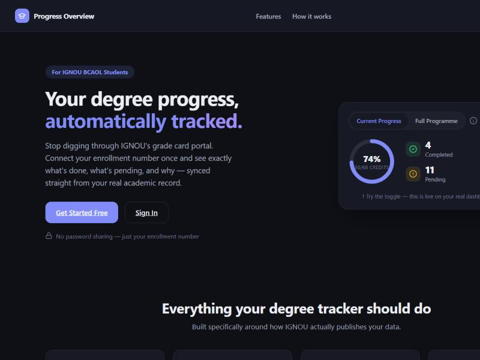

# Progress Overview



A degree progress dashboard for IGNOU BCAOL students. Create an account with your enrollment number, and your real grade card — assignment marks, term-end theory/practical scores, course-by-course status — is synced automatically from IGNOU's own public grade card site. No IGNOU password is ever collected.

**Live site:** [bca.igurvinder.in](https://bca.igurvinder.in)

## Features

- **Live sync from IGNOU** — fetches your real marks server-side from `gradecard.ignou.ac.in` using just your programme code and enrollment number, merges them against an official BCAOL course catalog, and writes the result to your account.
- **Pending breakdown** — a clear view of exactly which courses need an assignment submitted, a theory paper passed, or a practical passed, following IGNOU's own 35%-per-component passing rule.
- **Current Progress / Full Programme toggle** — scope your stats to just the semesters you've actually started, or see the complete 6-semester picture.
- **Private by design** — every account's data is isolated by Postgres Row Level Security; nothing is shared between students.
- **Public landing page** with an interactive demo, dark mode, and a polished dashboard UI — no framework, just HTML/CSS/vanilla JS.

## Architecture

- **Frontend:** static HTML/CSS/JS (`public/`), no build step, deployed on Vercel.
- **Auth & database:** Supabase (Auth + Postgres). Accounts are created with a synthetic email of `<enrolment-number>@<your-domain>` so the enrollment number doubles as the login identity — no real email is ever collected, which also means there's no email-based password reset (see `public/login.html` / `signup.html`).
- **Sync function:** `api/sync-gradecard.js`, a Vercel serverless function. It authenticates the caller via their Supabase session, fetches IGNOU's grade card server-side (the browser can't call it directly — cross-origin), parses the HTML table, and upserts the merged result using the Supabase service-role key.
- **Course catalog:** `supabase/migration_002_bcaol.sql` seeds the official BCAOL course scheme (code/title/credits/semester), transcribed from IGNOU's own Programme Guide and cross-checked against a real student's grade card.

Scope is intentionally limited to the **BCAOL** programme for now. IGNOU's `BCA_NEW` curriculum uses elective-based course groups that need their own data model before they can be supported safely — see commit history for the research behind that decision.

## Self-hosting

1. **Supabase**: create a project, then run `supabase/schema.sql`, `supabase/migration_002_bcaol.sql`, and `supabase/migration_003_gradecard_prog.sql` in order via the SQL Editor.
   - Under Authentication → Sign In / Providers: turn **on** "Allow new users to sign up", and turn **off** "Confirm email" (synthetic emails can't receive a real confirmation link).
2. **`public/config.js`**: fill in your project's URL and anon key (Project Settings → API). The anon key is safe to commit — it's protected by Row Level Security, not secrecy.
3. **Vercel**: import the repo, and set these environment variables (Production at minimum):
   - `SUPABASE_URL`
   - `SUPABASE_ANON_KEY`
   - `SUPABASE_SERVICE_ROLE_KEY` — a real secret, never commit this one.
4. **Domain / email convention**: `window.AUTH_EMAIL_DOMAIN` in `config.js` sets the synthetic email domain used for login. Point it at any domain you control (or a non-resolving placeholder — it's never actually emailed).
5. Create your first account by signing up at `/signup.html` with a real BCAOL enrollment number.

### Local development

```bash
docker compose up --build
```

Serves the static site on `http://localhost:4173` via nginx. The sync function (`api/sync-gradecard.js`) only runs on Vercel — local Docker is for frontend/UI work.

## License

All rights reserved. This repo is shared publicly for reference; please don't redistribute or deploy a copy without asking first.
